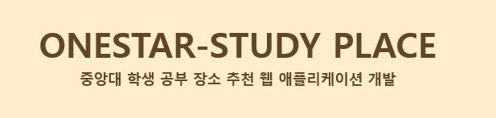

# OneStar 김벼리\_정지원

 

# :airplane: OneStar

중앙대 학생들을 위한 중앙대 인근 공부하기 좋은 카페 추천 웹사이트

 

# :bust_in_silhouette: Made by

- 김벼리
- 정지원

# :memo: 개발동기 및 제작 목적

> - 재학생 수에 비해 열람실 자리 부족
> - 프렌차이즈 카페는 자리 잡기가 어렵다
> - 원하는 카페를 찾기 위해서 검색을 여러번 해야한다.

### ▶ 공부가 잘 되는 카페, 가고 싶었던 카페와 비슷한 카페를 찾아주는 서비스를 제공하는 Web application

 

# 웹사이트

### Main Page

 

### 추천 카페 리스트

- 자체 추천 알고리즘을 사용하여 공부하기 좋은 카페 리스트를 보여준다.
  

 

### 좋아하는 카페와 비슷한 카페 찾기

- 좋아하는 카페를 고르면 그와 비슷한 리뷰가 많은 카페 리스트를 보여준다
  

 

### 스터디 카페 리스트

